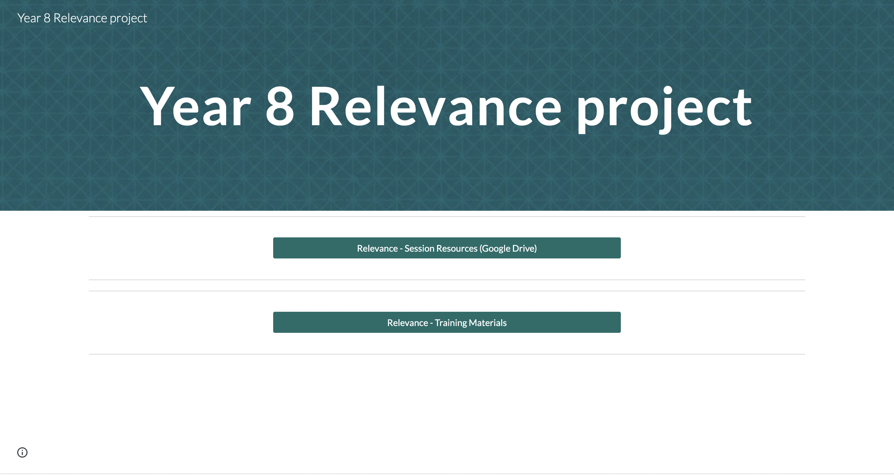
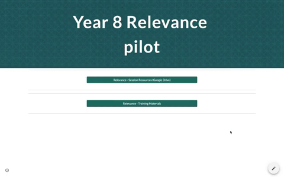

## Part 2: Year 8 Relevance Training - Getting started
You will be using App Lab to teach key programming concepts in the production of an app for a mobile device. Learners need not be familiar with programming at the start of the trial. Educators should be familiar with app design, idea development and App Lab. 

Parts 2 and 3 of this course focus on building up your expertise in advance of the trial as well as familiarising yourself with the resources. Over the rest of this online course you will have an opportunity to explore all the resources for yourself, try them out and think about how to implement the sessions in your own classroom.

This part, Part 2, of the course begins to introduce you to the online Relevance intervention resources. Then, through two tasks you will focus on the development of your own app idea that addresses a real-world issue. You will complete two sessions that the students themselves will undertake as part of the trial. 

## Accessing the resources
Firstly, you are going to access the session resources you will need for the Relevance trial. 

--- task ---

The session introduces you to the [Relevance Resource portal](https://ncce.io/relevance-pilot){:target="_blank"} where you can explore all the resources for Session 1 to 12. The webpage is the access portal for all the resources relating to the Relevance trial.

{:width="300px"}

Feel free to download the resources or access them each time you need them from the webpage. You may wish to bookmark the link to the resources in the browser toolbar of the teacher’s tablet/iPad/computer for ease of reference. 

Links to all of the resources can also be found in your [Project guide](https://ncce.io/xiv8pO){:target="_blank"}, on the [Lesson Wireframe](https://ncce.io/4PM6um){:target="_blank"} and also accessed via the [Google Drive](https://ncce.io/KNDNJR){:target="_blank"}.

--- /task ---

--- task ---

The main resources folder consists of one 'Session' sub-folder (containing resources to the  12 x sessions/1-hour lessons) as well as four further files: 
+ App Development Course Scheme of Work (SoW) (GoogleDoc)
+ App Design Student Workbook (GoogleSheets)
+ Lesson Wireframe (GoogleSlide)
+ Setting up App Lab Logins Guide (GoogleDoc)

--- /task ---

--- task ---

Take some time now to gain a brief overview of the 'App Development Scheme of Work (SoW)' and the 'Lesson Wireframe' files. You will have further opportunities to understand the sessions in more detail in the next steps.

--- /task ---

You will implement the Relevance intervention within these fully-resourced sessions prepared for the trial period.

Click the green button (below right) for the next step in Part 2.

You can go back to the [list of contents for this part (Part 2) here](https://projects.raspberrypi.org/en/projects/Year8-RelevanceTraining-Part2-GBICi4).
You can access the [menu for Parts 1, 2, and 3 here](https://projects.raspberrypi.org/en/pathways/year8-relevancetraining-gbici4).
