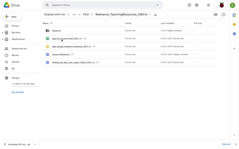

## Twelve sessions
Session 1 introduces learners generally to app development. From Sessions 2 to 4, students are introduced to the App Lab online environment and related blocks that can be used to construct a sample app. From session 5 to 7, learners are gradually introduced to the process of developing ideas for apps that can address a real-world problem. Over the course of session 8 and  subsequent sessions, students explore the programming concepts of sequencing and selection to produce an app of their choice.

In the main 'Sessions' folder, you will find 13 numbered session folders. 

Sessions 7 and 11 are offered as optional sessions. Teachers delivering the SoW can decide for all students to undertake Session 7 - the Industry Engagement session - where students pitch their ideas to industry Experts online. Teachers will need to plan this session well in advance. See the session Primer for further details. Teachers can also opt for all students to undertake Session 11 which is an additional app building session. If undertaking Session 10 and 11, students will have two full sessions to build and refine their app.

Each session folder includes the following:
+ Lesson primer
+ Lesson plan
+ Teacher slides
+ Student worksheet
+ Student checklist 
You may also find session-specific associated resources, such as related step-by-step guides.

You will find out more about the content of the session folders in the next step.

Click the green button (below right) to go to the next step in this session.

You can go back to the [start of Part 2 here](https://projects.raspberrypi.org/en/projects/Year8-RelevanceTraining-Part2-GBICi4).

You can access the [menu for Parts 1, 2, and 3 here](https://projects.raspberrypi.org/en/pathways/year8-relevancetraining-gbici4).
