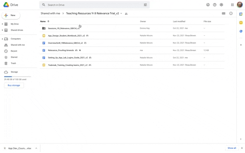

## Twelve sessions
Sessions 1 to 5 gradually introduce learners to the process of developing ideas for apps that can address a real-world problem. From Session 6, students are introduced to the App Lab environment and related blocks that can be used to construct their app. Over the course of these subsequent sessions, students explore the programming concepts of sequencing, selection, and repetition to produce an app of their choice.

In the main 'Sessions' folder, you will find 12 numbered session folders. 

Each session folder includes the following:
+ Lesson primer
+ Lesson plan
+ Teacher slides
+ Student worksheet
+ Student checklist 
You may also find session-specific associated resources, such as related step-by-step guides.

You will find out more about the content of the session folders in the next step.

Click the green button (below right) to go to the next step in this session.

You can go back to the [start of Part 2 here](https://projects.raspberrypi.org/en/projects/Year8-RelevanceTraining-Part2-GBICi4).

You can access the [menu for Parts 1, 2, and 3 here](https://projects.raspberrypi.org/en/pathways/year8-relevancetraining-gbici4).
