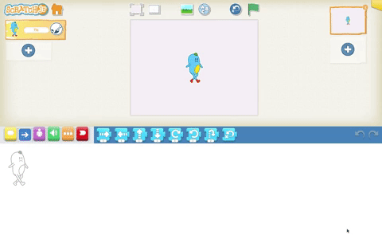

## Task 2: ScratchJr interface and blocks
In order to prepare for these units, you will need to familiarise yourself with the ScratchJr programming environment, including characters, the Blocks Palette, and the Programming Area. You will also need to ensure that you understand the following:
+ Triggering blocks: 'Start on Green Flag', 'Send Message' and 'Start on Message', 'Start on Bump', 'Start on Tap'
+ Motion blocks: 'Move Right', 'Move Left', 'Hop', 'Turn Right', 'Turn Left'
+ Selecting and placing characters
+ Control blocks: 'Repeat', 'Wait', 'Set Speed', 'Stop'
+ Background
+ Program for each character
+ Looks blocks: 'Say', 'Hide', 'Show', 'Grow', 'Shrink'
+ Paint Editor

In order to further your understanding, you can explore the following documents: 
+ [ScratchJr Interface Guide](https://www.scratchjr.org/pdfs/scratchjr-interface-guide.pdf) 
+ [ScratchJr Block Descriptions](https://www.scratchjr.org/pdfs/block-descriptions.pdf)

If you would like to learn more about the above, you can supplement your learning by undertaking Unit 1 – Lessons 2 to 6, and Unit 2 – Lessons 1 to 4.

Click the green button (below right) to go to the next step in this session.

You can go back to the [list of contents for this session (Session 3) here](https://projects.raspberrypi.org/en/projects/KS1StorytellingTraining_Session3_GBICi1b).
You can access the [menu for Sessions 1, 2, and 3 here](https://projects.raspberrypi.org/en/pathways/ks1-storytellingtraining-gbici1b).
