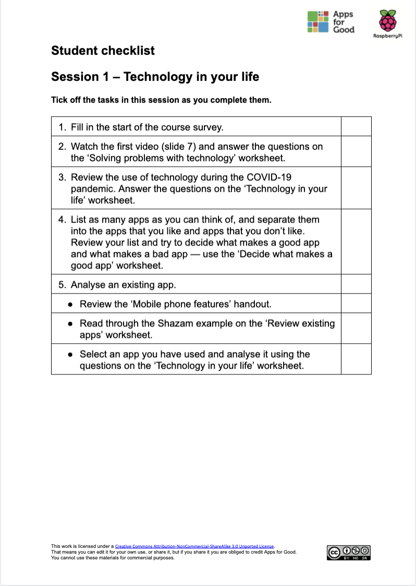

## Session Resources

Each of the 12 x sessions/1-hour lessons always includes the following resources: Lesson Primer, Lesson Plan, Teacher Slides and Student Checklist. The  purpose and use ofthese files are outlined further below. In some sessions you will also find session-specific documents.

**Lesson Primer**
All the Lesson Primers are structured in a consistent way with the following subheadings:
+ What you need to know about running this lesson: practical issues, documents required, and activity timings.
+ Key information and terminology
+ Assessment questions
+ Extension tasks
+ Further reading

**Lesson Plan**
The '5 Minute' Lesson Plan enables teachers to visualise the lesson. The one-page diagram includes: 
+ The BIG Picture
+ Objectives
+ Engagement
+ Key messages
+ AfL
+ Differentiation
+ Key words
+ Learning episodes - identifying whether these are teacher or student-led

**Lesson Slides**
All the lesson slides are structured in a consistent way, beginning with a reminder of the last session, the current session objectives and the activities the students will undertake. This introduction is followed by the session activities. At the end of the session, the slides always include the following: a student review of their progress, a reminder of the session contents and details about the focus of the next session.

Work your way through each session, exploring the Lesson Primer and Lesson Plan and their correlation to the Teacher Slides. Allowing yourself time for preparation now will make it easier to incorporate the 'Relevance' intervention into your lessons when the trial begins. 

**Student Checklist**
The one-page student-facing table enables students to tick off the tasks in the session as they complete them. It acts as a useful motivator, reminder and learning progression map. 
 

--- /task ---

--- task ---

Make a note of anything that you need to clarify. You can use the feedback form to ask questions to the trial community. You can also get in touch with us by email if you have any queries at any time before, during, or after the trial via [genderresearch@raspberrypi.org](mailto:genderresearch@raspberrypi.org).

--- /task ---

--- task ---

In the next step you will develop an understanding of app design and idea development processes in your first training task using in sessions 1 to 5 as a reference.

You can go back to the [list of contents for this part (Part 2) here](https://projects.raspberrypi.org/en/projects/Year8-RelevanceTraining-Part2-GBICi4). 
You can access the [menu for Parts 1, 2, and 3 here](https://projects.raspberrypi.org/en/pathways/year8-relevancetraining-gbici4).
