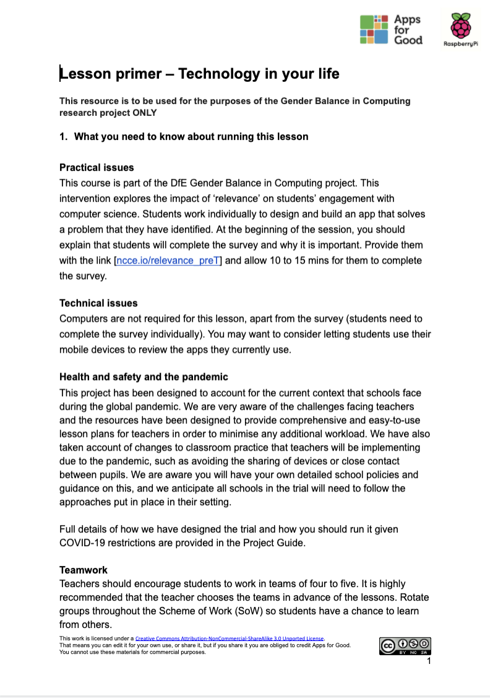

## Session resources
Below you will find an explanation of what each of the separate resources offers in each session.

--- task ---

**Lesson primer**
All the lesson primers are structured in a consistent way with the following subheadings:
+ What you need to know about running this lesson: practical issues, documents required, and activity timings
+ Key information and terminology
+ Assessment questions
+ Extension tasks (in some sessions)
+ Further reading

{:width="300px"}

**Lesson plan**
The 'five-minute' lesson plan enables teachers to visualise the lesson. The one-page diagram includes: 
+ The BIG picture?
+ Objectives
+ Engagement
+ Key messages
+ Assessment for learning (AfL)
+ Differentiation
+ Key words
+ Learning episodes — identifying whether these are teacher led or student led

{:width="400px"}

**Teacher slides**
All the teacher slides are structured in a consistent way, beginning with a reminder of the last session, the objectives of the current session, and the activities that the students will undertake. This introduction is followed by the session activities. At the end of the session, the slides always include the following: a student review of their progress, a reminder of the session contents, and details about the focus of the next session.

**Student checklist**
The one-page student-facing table enables students to tick off the tasks in the session as they complete them. It acts as a useful motivator, reminder, and learning progression map.
 
{:width="300px"}

**Student workbook and worksheets**
Each session folder contains a student worksheet. These worksheets are also combined into one 'Student workbook' file, which is in the main folder. Choose whether you want the students to have access to the whole workbook (see below) at the beginning of the trial, or to have access to the lesson worksheets in the relevant sessions. The student workbook is useful to document their learning.

--- /task ---

--- task ---

Work your way through each session, exploring the lesson primer and lesson plan and their correlation with the teacher slides. Allowing yourself time for preparation now will make it easier to incorporate the Relevance intervention into your lessons when the trial begins. 

Make a note of anything that you need to clarify. You can use the feedback form to ask questions to the trial community. You can also get in touch with us by email if you have any queries at any time before, during, or after the trial via [genderresearch@raspberrypi.org](mailto:genderresearch@raspberrypi.org).

--- /task ---

In the next step, you will develop an understanding of app design and idea development processes in your first training task.

Click the green button (below right) to go to the next step in this session.

You can go back to the [start of Part 2 here](https://projects.raspberrypi.org/en/projects/Year8-RelevanceTraining-Part2-GBICi4). 

You can access the [menu for Parts 1, 2, and 3 here](https://projects.raspberrypi.org/en/pathways/year8-relevancetraining-gbici4).
